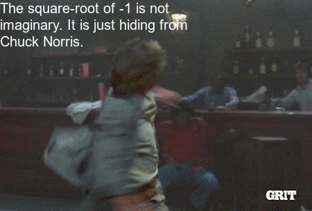

uc-bana7052
===========

Course materials for BANA 7052 (Applied Linear Regression) at UC

**Warning:** The following material is still being developed! ⚠️

[Course syllabus](https://bgreenwell.github.io/uc-bana7052/syllabus)

Lectures
--------

-   **Lecture 01:** Association and Simple Linear Regression;
    [Slides](https://bgreenwell.github.io/uc-bana7052/slides/lecture-01#1);
    [Homework](https://bgreenwell.github.io/uc-bana7052/homework/bana7052-hw1)

-   **Lecture 02:** Inferences in Simple Linear Regression;
    [Slides](https://bgreenwell.github.io/uc-bana7052/slides/lecture-01#1);
    [Homework](https://bgreenwell.github.io/uc-bana7052/homework/bana7052-hw2);
    Quiz

``` r
# Some useful R code
roundhouse::kick(
  paste("The square-root of -1 is not imaginary.",
        "It is just hiding from Chuck Norris."),
  width = 40, type = 2
)
```


