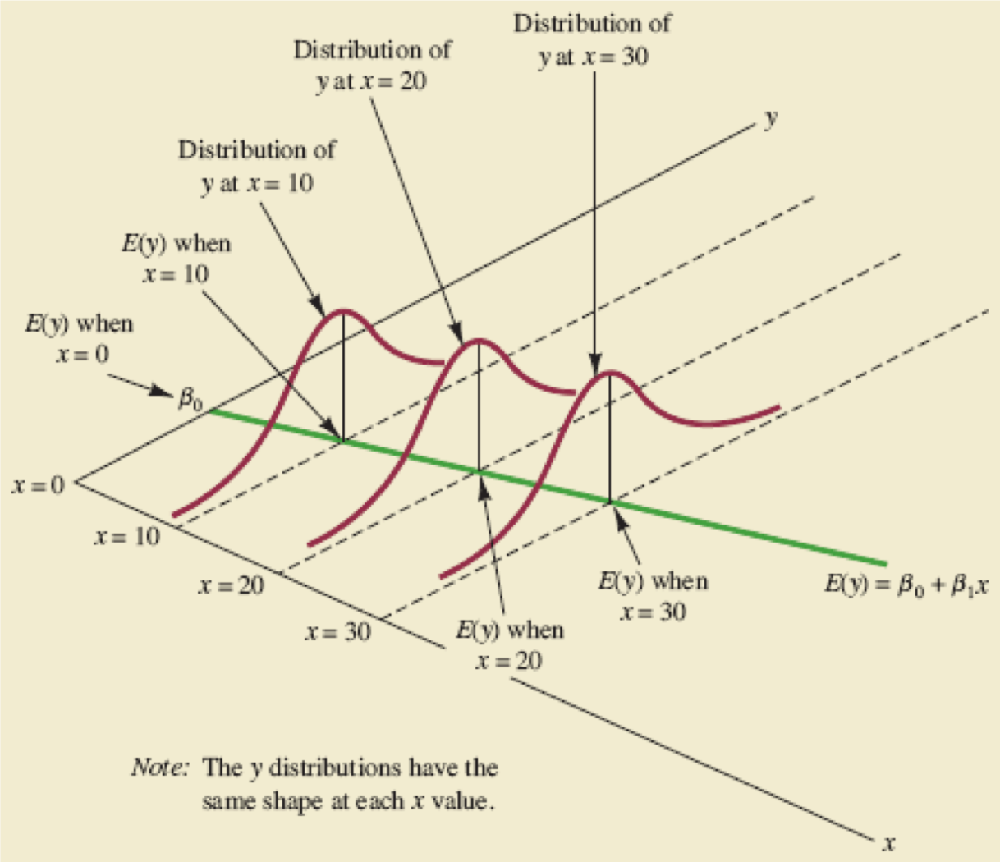

class: clear 

```{r setup, include=FALSE}
options(htmltools.dir.version = FALSE, servr.daemon = TRUE)

# Global chunk options
knitr::opts_chunk$set(
  echo = TRUE,
  # dev = "svg",
  fig.align = "center",
  fig.width = 6,
  fig.asp = 0.618,
  out.width = "70%",
  message = FALSE,
  warning = FALSE,
  error = FALSE
)

# Load required packages
library(dplyr)
library(patchwork)
```

background-image: url(https://creativemaths.net/wp-content/uploads/2012/03/it_is_so_easy1-704x480.png)

???


---
# Reading assignment

.larger[

* Chapter: 1

* Sections: 1.1-1.8

* Main topics:

    - Association `r set.seed(101); emo::ji("sleep")`
    
    - Simple linear regression
  
]


---

# Prerquisites

.scrollable[

```{r prerequisites, eval=FALSE}
# List of required (CRAN) packages
pkgs <- c(
  "animation",  # for pre-built statistical animations
  "dplyr",      # for data wrangling
  "ggplot2",    # for awesome graphics
  "HistData",   # for historical data sets
  "tibble"      # for nicer data frames
)

# Install required (CRAN) packages
for (pkg in pkgs) {
  if (!requireNamespace(pkg)) {  # check if already installed first
    install.packages(pkg)  # install it
  }
}

# Install additional (optional) awesomeness
install.packages(c("devtools", "magick"))
devtools::install_github("bgreenwell/roundhouse")
```

]


---

# Ready to begin?

--

```{r roundhouse-01}
roundhouse::kick("Chuck Norris knows the last digit of pi", 
                 width = 50)
```


---
class: center, middle

# Read the `r emo::ji("book")`!

```{r wonka, echo=FALSE, out.width="60%"}
knitr::include_graphics("images/read-the-book.jpg")
```


---

# Statistical relationships

.scrollable[

```{r statistical-relationships-01, eval=FALSE}
# Load required packages
library(ggplot2)
library(tibble)

# Generate some random data
set.seed(101)
d <- tibble(
  x = seq(from = -2, to = 2, length = 100),
  y1 = 1 + x + rnorm(length(x)),
  y2 = 1 + x^2 + rnorm(length(x)),
  y3 = 1 + x^3 + rnorm(length(x)),
  y4 = 1 + rnorm(length(x))
)

# Construct scatterplots
p1 <- ggplot(d, aes(x = x, y = y1)) +
  geom_point(alpha = 0.5) + 
  labs(y = "y", title = "Linear")
p2 <- ggplot(d, aes(x = x, y = y2)) +
  geom_point(alpha = 0.5) + 
  labs(y = "y", title = "Quadratic")
p3 <- ggplot(d, aes(x = x, y = y3)) +
  geom_point(alpha = 0.5) + 
  labs(y = "y", title = "Cubic")
p4 <- ggplot(d, aes(x = x, y = y4)) +
  geom_point(alpha = 0.5) + 
  labs(y = "y", title = "None")

# Display plots in a grid
gridExtra::grid.arrange(p1, p2, p3, p4, ncol = 2)
```

]


---

# Statistical relationships

```{r statistical-relationships-02, echo=FALSE, out.width="100%"}
# Load required packages
library(ggplot2)
library(tibble)

# Set ggplot2 theme
theme_set(theme_light())

# Generate some random data
set.seed(101)
d <- tibble(
  x = seq(from = -2, to = 2, length = 100),
  y1 = 1 + x + rnorm(length(x)),
  y2 = 1 + x^2 + rnorm(length(x)),
  y3 = 1 + x^3 + rnorm(length(x)),
  y4 = 1 + rnorm(length(x))
)

# Construct scatterplots
p1 <- ggplot(d, aes(x = x, y = y1)) +
  geom_point(alpha = 0.5) + 
  labs(y = "y", title = "Linear")
p2 <- ggplot(d, aes(x = x, y = y2)) +
  geom_point(alpha = 0.5) + 
  labs(y = "y", title = "Quadratic")
p3 <- ggplot(d, aes(x = x, y = y3)) +
  geom_point(alpha = 0.5) + 
  labs(y = "y", title = "Cubic")
p4 <- ggplot(d, aes(x = x, y = y4)) +
  geom_point(alpha = 0.5) + 
  labs(y = "y", title = "None")

# Display plots in a grid
gridExtra::grid.arrange(p1, p2, p3, p4, ncol = 2)
```


---

# Pearson correlation

```{r pearson-correlation-01, echo=FALSE, fig.width=7, fig.height=5, out.width="100%"}
set.seed(101)
d <- tibble(
  x = seq(from = -2, to = 2, length = 100),
  y1 = 1 + x + rnorm(length(x)),
  y2 = 1 - x + rnorm(length(x)),
  y3 = 1 + x^2 + rnorm(length(x)),
  y4 = 1 + rnorm(length(x))
)
p1 <- ggplot(d, aes(x = x, y = y1)) +
  geom_point(alpha = 0.75) + 
  labs(y = "y", title = "Positive")
p2 <- ggplot(d, aes(x = x, y = y2)) +
  geom_point(alpha = 0.75) + 
  labs(y = "y", title = "Negative")
p3 <- ggplot(d, aes(x = x, y = y4)) +
  geom_point(alpha = 0.75) + 
  labs(y = "y", title = "None")
p4 <- "images/correlation-coefficient.png" %>%
  png::readPNG() %>%
  grid::rasterGrob(interpolate = TRUE, width = 0.8)
p4 <- ggplot() +
  annotation_custom(p4, xmin = -Inf, xmax = Inf, ymin = -Inf, ymax = Inf)
p1 + p2 + p3 - p4 + 
  plot_layout(ncol = 1, widths = c(1, 1, 1), heights = c(1, 1.5))
# (p1 | p2 | p3) / p4
```


---

# Pearson correlation

```{r pearson-correlation-02, echo=FALSE}
ggplot(d, aes(x = x, y = y3)) +
  geom_point(alpha = 0.5) + 
  labs(y = "y", title = "?")
```


---

# Pearson correlation

.large[

* The (Pearson) correlation coefficient (also called the *Pearson product-moment correlation coefficient*) between two random variables $X$ and $Y$ is given by 

$$Cor\left(X, Y\right) = \rho = \frac{Cov\left(X,Y\right)}{\sigma_X\sigma_Y}$$

* Given a sample $\left\{\left(x_i, y_i\right)\right\}_{i=1}^n$, we estimate $\rho$ with $r = S_{xy} / \sqrt{S_{xx}S_{yy}}$

  - Where, for example, $S_{xy} = \sum_{i=1}^n\left(x_i - \bar{x}\right)\left(y_i - \bar{y}\right)$

]


---

# Pearson correlation

.medium[

* It is common to test the hypothesis $H_0: \rho = 0$ vs. $H_1: \rho \ne 0$

    - Rejecting $H_0$ is only evidence that $\rho$ is **not exactly zero**

    - A *p*-value **does not measure the magnitude of the (linear) association**

    - Sample size affects the p-value! `r emo::ji("scream")`

* There is a formal relationship between Pearson's correlation and the *simple linear regression* (SLR) model

    - Simple linear relationships can be described by a *slope* and *intercept*

]


---

# Interpretting correlation(s) `r emo::ji("warning")`

.large[

* Correlation between $X$ and $Y$ does not imply causation

    - It does not imply the direction of any possible **causal relationship** between $X$ and $Y$
    
    - There might be a third (*lurking*) variable that is the cause of changes in both variables (i.e., the association between $X$ and $Y$ might be indirect)
    
* The Pearson correlation only measures the **linear association **between $X$ and $Y$

]


---
# Reading data into R

```{r reading, echo=FALSE, out.width="80%"}
knitr::include_graphics("images/reading.jpg")
```


---

# Crystal weight data

The data frame `investr::crystal` gives the growing time and final weight of `r nrow(investr::crystal)` crystals:

.scrollable[

```{r crystal}
# Load the crystal weight data
data(crystal, package = "investr")
tibble::as_tibble(crystal)  # print a summary of the data
```

]


---

# Your turn `r emo::ji("scream")`

* Draw a scatter plot of `time` vs `weight` for the `crystal` data frame

    - Does there appear to be an association between these two variables?
    
    - Describe the nature of the association (if it exists)

* Use the `cor()` and `cor.test()` functions to assess the Pearson correlation between these two variables

    - **Hint:** Use `?cor` and `?cor.test` to see how to use these functions and for explanations of their respective output
    
    - Interpret the *p*-value in the output


---

# Solution `r set.seed(205); emo::ji("raised")`

.scrollable[

```{r your-turn-01}
# Scatterplot using base R graphics
# plot(crystal)  # OK  #<<
plot(weight ~ time, data = crystal)  # better  #<<

# Scatterplot using ggplot2
ggplot(crystal, aes(x = time, y = weight)) +
  geom_point()

# Correlation matrix
cor(crystal)
with(crystal, cor(time, weight))   #<< 
cor(crystal$time, crystal$weight)  #<< 

# Test for (linear) association
with(crystal, cor.test(time, weight, conf.level = 0.95))
```

]


---

# Correlation and causation?

<iframe width="560" height="315" src="https://www.youtube.com/embed/ntnalq-2nNU" frameborder="0" allow="autoplay; encrypted-media" allowfullscreen></iframe>


---
class: center, middle

.huge[

[Fun with spurious correlations](http://www.tylervigen.com/spurious-correlations)

]


---
class: center, middle

```{r correlation-causation, echo=FALSE, out.width="100%", fig.cap="If you get the joke in this comic, then you probably undestand enough about correlation!"}
knitr::include_graphics("images/correlation-causation-comic.png")
```


---

# Which of the following statements are true?

.medium[

a. The Pearson correlation coefficient is a measure of linear association

b. A non-significant *p*-value for a Pearson correlation means no relationship

c. A negative Pearson correlation indicates a low degree of linear association

d. A random cloud of data implies a negative correlation.

]


---

# Which of the following statements are true?

.medium[

a. .green[The Pearson correlation coefficient is a measure of linear association]

b. .red[A non-significant *p*-value for a Pearson correlation means no relationship]

c. .red[A negative Pearson correlation indicates a low degree of linear association]

d. .red[A random cloud of data implies a negative correlation]

]


---
class: clear, middle

```{r george-box, echo=FALSE, out.width="30%", fig.pos="center"}
knitr::include_graphics("images/george-box.jpg")
```

> "All models are wrong, but some are useful."
>
> `r tufte::quote_footer('--- "George E. Box')`


---

# Historical origins of regression

.large[

* First developed by Sir Francis Galton in the later part of the 19th century

* Studied heights of parents and their children

* Noted that the heights of children with tall/short parents tended to "revert" or "regress" to the mean of the group

* The term "regression" persists to this day!

]


---

# Historical origins of regression

.scrollable[

```{r galton-01}
# Scatterplot of Galton's data on the heights of parents and their children
ggplot(HistData::Galton, aes(x = parent, y = child)) +
  geom_point(alpha = 0.5) +
  geom_smooth(method = "lm", formula = y ~ x, se = FALSE) +
  geom_abline(intercept = 0, slope = 1, linetype = "dashed") + 
  labs(x = "Height of mid-parent (in)", y = "Height of child (in)")
```

]


---

# Functional relationships

.scrollable[

```{r functional-relation}
# Scatterplot of (fake) functional data
ggplot(data.frame(x = 1:10, y = 15*1:10), aes(x, y)) +
  geom_line() +
  geom_point(size = 2, color = "red2") +
  labs(x = "Hours worked (X)", y = "Rate of pay (Y)", 
       title = expression(paste("Relation: ", Y == 15 %*% X)))
```

]


---

# Statistical relationships

```{r linear-relationships, echo=FALSE, fig.width=7, fig.height=3.5}
p1 <- ggplot(investr::crystal, aes(x = time, y = weight)) +
  geom_point() +
  labs(x = "Time (hours)", 
       y = "Weight (grams)", 
       title = "Crystal weight data")
p2 <- ggplot(investr::arsenic, aes(x = actual, y = measured)) +
  geom_point() +
  labs(x = "True amount of arsenic", 
       y = "Measured amount of arsenic",
       title = "Arsenic concentration data")
gridExtra::grid.arrange(p1, p2, nrow = 1)
```


---

## Examples of statistical relationships

.scrollable[

.medium[

* Simple linear regression (SLR)

    $$Y = \beta_0 + \beta_1 X + \epsilon$$
    
* Multiple linear regression (MLR)

    $$Y = \beta_0 + \beta_1 X_1 + \beta_2 X_2 + \dots + \beta_p X_p + \epsilon \\ = \beta_0 + \sum_{i=1}^p \beta_p X_p + \epsilon$$
    
 * Polynomial regression (of degree $p$)

    $$Y = \beta_0 + \sum_{i=1}^p \beta_p X^p + \epsilon$$ 

 * Nonlinear regression

    $$Y = \frac{\beta_1 X}{\beta_2 + X} + \epsilon$$   

]

]


---

# Still with me?

--

```{r roundhouse-02}
roundhouse::kick("Chuck Norris caught all the Pok\uE9mon from a landline",
                 width = 40, type = 2, fps = 10)
```


---

# Simple linear regression (SLR)

.medium[

* Data: $\left\{\left(X_i, Y_i\right)\right\}_{i=1}^n$

]

--

.medium[ 

* Model: $Y_i = \beta_0 + \beta_1 X_i + \epsilon_i$

    - $Y_i$ is a continuous response

    - $X_i$ is a continuous predictor

    - $\beta_0$  is the intercept of the regression line (also called the *bias term*)

    - $\beta_1$  is the slope of the regression line
    
    - $\epsilon_i \stackrel{iid}{\sim} \left(0, \sigma^2\right)$

]


---

# Assumptions about the errors

.large[

* For $i/j = 1, 2, \dots, n$

    1) $\quad E\left(\epsilon_i\right) = 0$

    2) $\quad Var\left(\epsilon_i\right) = \sigma^2$ (homoscedacticity `r emo::ji("scream")`)

    3) $\quad Cov\left(\epsilon_i, \epsilon_j\right) = 0$ (independence)

]

--

.large[

* Assumptions 1)-3) can be summarized as $\epsilon_i \stackrel{iid}{\sim} \left(0, \sigma^2\right)$

]


---

# Properites of SLR

.large[

* Simple linear regression: $Y_i = \beta_0 + \beta_1 X_i + \epsilon_i$

    - Implies the model is **linear in the regression coefficients $\beta_0$ and $\beta_1$**
    
* The error term is a random variable; hence, $Y_i$ is also a random variable (**Why?** `r emo::ji("thinking")`)

    - What is $E\left(Y_i|X_i\right)$ and $Var\left(Y_i|X_i\right)$?
    
* $Cor\left(Y_i, Y_j\right) = 0$ $\forall i \ne j$ (**Why?** `r emo::ji("thinking")`)

]


---

# SLR with normal errors

.large[

* $Y_i = \beta_0 + \beta_1 X_i + \epsilon_i, \quad i = 1, 2, \dots, n$

where $\epsilon_i \stackrel{iid}{\sim} N\left(0, \sigma^2\right)$

]

--

.red[**OR, EQUIVALENTLY**]

.large[

* $Y_i \stackrel{indep.}{\sim} N\left(\beta_0 + \beta_1 X_i, \sigma^2\right), \quad i = 1, 2, \dots, n$

     - $\mu_i = \beta_0 + \beta_1 X_i$ is called the *linear predictor* (LP)

]


---

# Interpretting the regression coefficients

.medium[

* $\beta_0$ is the *y*-intercept (or *bias term*)

    - It represent the mean response when $X = 0$; that is $\beta_0 = E\left(Y|X = 0\right)$

    - In general, the intercept is of little practical interest (this is especially true in MLR or when zero is not a valid value of $X$)

* $\beta_1$ is the slope of the regression line

    - The slope of a line represents a *rate of change*
    
    - It represents the change in the mean response per one-unit increase in $X$

]


---
class: center, middle 

```{r slr-conditional-distribution, echo=FALSE, fig.width=7, fig.height=7, out.width="90%"}

```


---
class: center, middle

```{r arsenic-conditional-distribution, echo=FALSE, out.width="100%"}
# Scatterplot of arsenic data
ggplot(investr::arsenic, aes(x = actual, y = measured)) + 
  geom_point(alpha = 0.75) +
  geom_smooth(method = "lm", se = FALSE, size = 0.5) + 
  labs(x = "Actual amount (ppm)", "Measured amount (ppm)",
       title = "Arsenic concentration data")
```


---

# How do we estimate $\beta_0$ and $\beta_1$?

--

* Ideally, we want estimates of $\beta_0$ and $\beta_1$ that give us the "best fitting" line

    - But what is meant by "best fitting"?

--

* The most common approach is to use the method of *least squares* (LS) estimation

* The LS estimates of $\beta_0$ and $\beta_1$ minimize the residual sum of squares (RSS):

$$RSS\left(\beta_0, \beta_1\right) = \sum_{i=1}^n\left[Y_i = \left(\beta_0 + \beta_1 X_i\right)\right]^2 = \sum_{i=1}^n\left(Y_i - \beta_0 - \beta_1 X_i\right)^2$$

* $Y_i - \left(\beta_0 + \beta_1 X_i\right) = \epsilon_i$ are called the *residual errors*

--

.large[

* Why minimize $\sum_{i=1}^n\epsilon_i^2$? Why not $\sum_{i=1}^n\left|\epsilon_i\right|$ or something more general like $\sum_{i=1}^n\psi\left(\epsilon_i\right)$?

]


---

# LS estimation

* How do me minimize $RSS\left(\beta_0, \beta_1\right) = \sum_{i=1}^n\left(Y_i - \beta_0 - \beta_1 X_i\right)^2$?

--

.center[.huger[Calculus!]]


---

# Test to see if you remember calculus

.huge[

If $y = \int_a^af\left(x\right)dx$ and I have $y$ followers on Twitter `r emo::ji("bird")`, how many followers do I have? 

]


---

# Derive the LS estimates of $\beta_0$ and $\beta_1$

```{r homer-simpson-smart, echo=FALSE, out.width="40%"}

```


---

# The LS estimates of $\beta_0$ and $\beta_1$

.medium[

* $\widehat{\beta}_1 = \frac{\sum_{i=1}^n\left(X_i - \bar{X}\right)\left(Y_i - \bar{Y}\right)}{\sum_{i=1}^n\left(X_i - \bar{X}\right)^2} = \frac{S_{xy}}{ S_{xx}} = \sum_{i=1}^n\left(\frac{X_i - \bar{X}}{\sum_{i=1}^n\left(X_i - \bar{X}\right)^2}\right)Y_i = \sum_{i=1}^n w_iY_i$
    
* $\widehat{\beta}_0 = \bar{Y} - \widehat{\beta}_1 \bar{X}$

]

--

.medium[

* Don't bother trying to memorize these formulas! `r set.seed(101); emo::ji("laugh")`

]

--

.medium[

* Once we start adding more predictors (.red[i.e., real life]), we lose the ability to easily find closed-form formulas like these and rely on numerical approximations to find them (e.g., in R or SAS)

* As will be proven later, the LS approach provides the .purple[*best linear unbiased estimators*] (BLUE) of $\beta_0$ and $\beta_1$

]


---

# Visualizing least squares

.large[

Take five minutes and try running the following code:

```{r animation, eval=FALSE}
animation::least.squares(ani.type = "slope")
animation::least.squares(ani.type = "intercept")
```

What do you think is happening here?

]


---
class: inverse, center, middle

# Fitting the SLR Model in R


---

# The `lm()` function

* The `lm()` function can be used to fit the SLR model (or any LM for that matter!)

* The statement `lm(y ~ x, data = df)` fits an SLR model by regressing `y` on `x`, where `y` and `x` are columns in `df`

* To suppress the intercept term, use `y ~ x - 1`


---

# Your turn `r emo::ji("scream")`

.larger[Fit an SLR model to the crystal weight data using `weight` as the response and `time` as the predictor and interpret the estimated coefficients.]


---

# Solution `r set.seed(205); emo::ji("raised")`

.scrollable[

```{r your-turn-02}
# Load the data (if not already loaded)
data(crystal, package = "investr")

# Fit an SLR model to the data
fit <- lm(weight ~ time, data = crystal)
print(fit)  # print a basic summary

# More verbose summary
summary(fit)
```

* The average final weight of crystals increases by an estimated `r round(coef(fit)[2L], digits = 3)` grams for every one-hour increase in growth time `r emo::ji("clock")`

* Does interpreting the intercept make sense in this problem?

]


---

# The fitted SLR model

.scrollable[

* The fitted model is given by $\widehat{Y} = \widehat{\beta}_0 + \widehat{\beta}_1$

* We refer to $\widehat{Y}$ as the predicted value

* The fitted values: $\widehat{Y}_i = \widehat{\beta}_0 + \widehat{\beta}_1 X_i, \quad i = 1, 2, \dots, n$

* Use `fitted()` to obtain the fitted values:

```{r fitted-values}
head(cbind(crystal, "fitted_values" = fitted(fit)))
```

]


---

# Residuals: $Y_i - \widehat{Y}_i$

.scrollable[

```{r crystal-residuals}
# Residual plot
ggplot(data = crystal, aes(x = time, y = weight)) +
  geom_point(size = 2) +
  geom_smooth(method = "lm", formula = y ~ x, se = FALSE, alpha = 0.5) +
  geom_segment(aes(x = time, y = fitted(fit), xend = time, yend = weight), 
               alpha = 0.75, col = "red2", linetype = "solid") +
  theme_light() +
  xlab("Time (weeks)") +
  ylab("Weight (grams)") +
  ggtitle("Crystal weight data")
```

]


---

# Properties of the residuals

.large[

* $\sum_{i=1}^n e_i = 0$ (.purple[**Why?**] `r emo::ji("thinking")`)

]


---

# Your turn `r emo::ji("scream")`

.large[

1. Simulate $Y_i \stackrel{indep.}{\sim} N\left(\mu = 1 + 2X_i, \sigma^2 = 1.2^2\right)$ for $i = 1, 2, \dots, 30$, where $X_i \stackrel{iid}{\sim} U\left(0, 5\right)$

2. Fit an SLR model to the data and estimate the slope and intercept. Do the estimated slope and intercept match closely with the true values? What happens to the estimates if we generate the response from a $N\left(\mu = 1 + 2X_i, \sigma^2 = 0.2^2\right)$ distribution instead?

]


---

# Solution `r set.seed(205); emo::ji("raised")`

.scrollable[

```{r your-turn-03}
# Simulate data
set.seed(1105)  # for reproducibility
x <- runif(30, min = 0, max = 5)  # see ?runif for details
y <- rnorm(30, mean = 1 + 2*x, sd = 1.2)

# Simple scatterplot
plot(x, y)

# Fit a SLR model
lm(y ~ x)
```

]


---

# Properties of the fitted SLR model

.medium[

* $\sum_{i=1}^n e_i = 0$

* $\sum_{i=1}^n e_i^2$ minimizes is a minimum

* $\sum_{i=1}^n X_ie_i = 0$

* $\sum_{i=1}^n \widehat{Y}_ie_i = 0$

* The LS regression line passes through the point $\left(\bar{X}, \bar{Y}\right)$ (i.e., the center of the training data)

]

--

.large[How can we prove the above properties?]


---

# Estimating the error variance $\sigma^2$

* What are the unknown parameters of the SLR model $Y_i = \beta_0 + \beta_1X_i + \epsilon_i$?

--

* Assuming $\epsilon_i \stackrel{iid}{\sim} N\left(0, \sigma^2\right)$, we have an additional (unknown) parameter: $\sigma^2$

* How do we estimate $\sigma^2$ (LS estimation only provides estimates for the slope and intercept)


---

# Maximum likelihood estimation

.medium[

Since $Y_i \stackrel{indep.}{\sim} N\left(\beta_0 + \beta_1X_i, \sigma^2\right)$, the *likelihood function* for the data (as a function of $\beta_0$, $\beta_1$, and $\sigma^2$) is given by 

$$L\left(\beta_0, \beta_1, \sigma^2\right) = \prod_{i=1}^nf\left(Y_i; \beta_0 + \beta_1X_i, \sigma^2\right),$$ where $$f\left(Y_i; \beta_0 + \beta_1X_i, \sigma^2\right) = \frac{1}{\sigma\sqrt{2\pi}}\exp\left(-\frac{Y_i - \beta_0 - \beta_1 X_i}{2\sigma^2}\right)$$ is the *probability density function* (PDF) of a normal distribution with mean $\beta_0 + \beta_1X_i$ and variance $\sigma^2$.

]


---

# Maximum likelihood estimation

* Maximizing the likelihood is the same as maximizing the *log-likelihood* $l = \log\left(L\right)$ (**Why?** `r emo::ji("thinking")`)

* The full log-likelihood is given by 

$$l = -\frac{n}{2}\log\left(2\pi\right) - \frac{n}{2}\log\left(\sigma^2\right) - \frac{1}{2\sigma^2}\sum_{i=1}^n\left(Y_i - \beta_0 - \beta_1X_i\right)^2$$

* Maximum likelihood (ML) estimates of $\beta_0$, $\beta_1$, and $\sigma^2$ can be found by equating the (partial) derivatives of $l$ to zero:

    - $\frac{\partial l}{\partial \beta_0} = \frac{1}{\sigma^2}\sum_{i=1}^n\left(Y_i - \beta_0 - \beta_1X_i\right)$
    
    - $\frac{\partial l}{\partial \beta_1} = \frac{1}{\sigma^2}\sum_{i=1}^nX_i\left(Y_i - \beta_0 - \beta_1X_i\right)$
    
    - $\frac{\partial l}{\partial \sigma^2} = -\frac{n}{2\sigma^2} + \frac{1}{\sigma^4}\sum_{i=1}^n\left(Y_i - \beta_0 - \beta_1X_i\right)^2$


---

# Maximum likelihood estimation

.medium[

* As it turns out, the ML estimates of $\beta_0$ and $\beta_1$ (under our current assumptions) are the same as the corresponding LS estimates

* ML estimation, however, provides us with an estimate of the error variance $\sigma^2$ 
$$\widehat{\sigma}_{MLE}^2 = \frac{1}{n}\sum{i=1}^n e_i^2$$

* However, since $\widehat{\sigma}_{MLE}^2$ is a biased estimate for the error variance, we use an adjusted estimate

$$\widehat{\sigma}^2 = \frac{1}{n-2}\sum{i=1}^n e_i^2 = MSE$$

]


---

# Your turn `r emo::ji("scream")`

.large[

Use the `fitted()`, `residuals()`, and `sigma()` functions to obtain the fitted values, residuals, and RMSE, respectively, for the crystal weight example. Confirm the formula for the residuals.

]


---
class: center, middle

.huge[

[Rocket propellant example](https://github.com/bgreenwell/uc-bana7052/blob/master/code/rocket.R)

]
