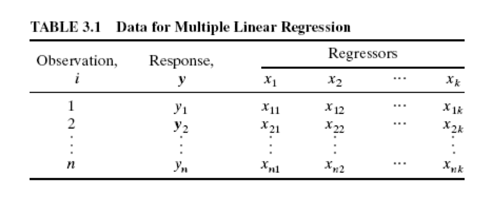

class: clear 

```{r setup, include=FALSE}
options(htmltools.dir.version = FALSE, servr.daemon = TRUE)

# Global chunk options
knitr::opts_chunk$set(
  cache = FALSE,
  echo = TRUE,
  dev = "svglite",
  fig.align = "center",
  # fig.width = 6,
  # fig.asp = 0.618,
  # out.width = "70%",
  message = FALSE,
  warning = FALSE,
  error = FALSE
)

# Bitmoji id
my_id <- "1551b314-5e8a-4477-aca2-088c05963111-v1"

# Load required packages
library(dplyr)
library(patchwork)
```

background-image: url(images/linear-algebra.jpg)


---
# Reading assignment

.larger[

* Chapters: 5; 6

    - Sections: 5.9-5.11; 6.1-6.4

* Main topics:

    - Regression in matrix form (5.9-5.11)
   
    - Multiple linear regression (6.1-6.4)

  
]


---

# Prerquisites

.scrollable[

.medium[

```{r prerequisites, eval=FALSE}
# List of required (CRAN) packages
pkgs <- c(
  "GGally",     # for gggplot2 extensions
  "pdp",        # for (corrected) Boston housing data
  "plotly",     # for interactive plots
  "tibble",     # for nicer data frames
  "vip"         # for variable importance plots
)

# Install required (CRAN) packages
for (pkg in pkgs) {
  if (!requireNamespace(pkg)) {  # check if already installed
    install.packages(pkg)  # install it
  }
}

# Install additional (optional) awesomeness
install.packages(c("devtools", "magick"))
devtools::install_github("bgreenwell/roundhouse")
```

]

]


---

# Ready to begin?

--

```{r roundhouse-01}
roundhouse::kick("When someone tells you to memorize the formulas in SLR", 
                 type = 2, fps = 10, width = 50)
```


---

# Multiple linear regression models

Suppose that the yield in pounds of conversion in a chemical process depends on temperature and the catalyst concentration. A .darkorange[multiple linear regression] (MLR) model that might describe this relationship is $$Y_i = \beta_0 + \beta_1 X_{1i} + \beta_2 X_{2i} + \epsilon_i, \quad i = 1, 2, \dots, n$$
where $$\epsilon_i \stackrel{iid}{\sim} \left(0, \sigma^2\right)$$

--

Hence, the mean response is $$E\left(Y_i\right) = \beta_0 + \beta_1 X_{1i} + \beta_2 X_{2i}$$

--

.center[.content-box-yellow[

This is an MLR model in two features $X_1$ and $X_2$

]]


---
class: clear

.scrollable[

```{r mlr-3d-sim-01, fig.width=6, fig.asp=0.618, out.width="100%"}
# Load required packages
library(plotly)
library(tibble)

# Simulate data from an MLR model
set.seed(101)  # for reproducibility
n <- 50
sim <- tibble(
  x1 = runif(n),
  x2 = runif(n),
  y = 1 + 2*x1 - 3*x2 + rnorm(n, sd = 1)  #<<
)

# Print first few observations
print(sim)
```

]


---
class: clear

.scrollable[

```{r mlr-3d-sim-02, fig.width=6, fig.asp=0.618, out.width="90%"}
# Construct a scatterplot matrix
pairs(sim, cex = 1.2, pch = 19, col = adjustcolor("purple", alpha.f = 0.5))
```

]


---
class: clear

.medium[

```{r mlr-3d-sim-03, eval=FALSE}
# Load required packages
library(plotly)  # for interactive plotting  #<<

# Draw (interactive) 3-D scatterplot
plot_ly(data = sim, x = ~x1, y = ~x2, z = ~y, mode = "markers", 
        type = "scatter3d",
        marker = list(opacity = 0.7, symbol = 1, 
                      size = 5, color = "black")) %>%
  layout(
    scene = list(
      aspectmode = "manual", 
      aspectratio = list(x = 1, y = 1, z = 1),
      xaxis = list(title = "X1", range = c(0, 1)),
      yaxis = list(title = "X2", range = c(0, 1)),
      zaxis = list(title = "Y")
    )
  )
```

]


---
class: clear, middle, center

.scrollable[

```{r mlr-3d-sim-04, echo=FALSE, out.width="100%"}
# Load required packages
library(plotly)  # for interactive plotting

# Draw (interactive) 3-D scatterplot
plot_ly(data = sim, x = ~x1, y = ~x2, z = ~y, mode = "markers", 
        type = "scatter3d",
        marker = list(opacity = 0.7, symbol = 1, size = 5, color = "black")) %>%
  layout(
    scene = list(
      aspectmode = "manual", aspectratio = list(x = 1, y = 1, z = 1),
      xaxis = list(title = "X1", range = c(0, 1)),
      yaxis = list(title = "X2", range = c(0, 1)),
      zaxis = list(title = "Y")
    )
  )
```

]


---
class: clear

.scrollable[

```{r mlr-3d-sim-05, eval=FALSE}
# Fit an MLR model to the simulated data
fit <- lm(y ~ x1 + x2, data = sim)  #<<
(betas <- coef(fit))  #<<
## (Intercept)          x1          x2  #<<
##   0.8834363   2.3265433  -2.9942737  #<<

# Generate predictions over a fine grid  #<<
.x1 <- .x2 <- seq(from = 0, to = 1, length = 50)
yhat <- t(outer(.x1, .x2, function(x1, x2) {
  betas[1] + betas[2]*x1 + betas[3]*x2
}))

# Draw (interactive) 3-D scatterplot with fitted mean response
plot_ly(x = ~.x1, y = ~.x2, z = ~yhat, 
        type = "surface", opacity = 0.7) %>%
  add_trace(data = sim, x = ~x1, y = ~x2, z = ~y, 
            mode = "markers", 
            type = "scatter3d",
            marker = list(opacity = 0.7, symbol = 1, 
                          size = 5, color = "black")) %>%
  layout(
    scene = list(
      aspectmode = "manual", 
      aspectratio = list(x = 1, y = 1, z = 1),
      xaxis = list(title = "X1", range = c(0, 1)),
      yaxis = list(title = "X2", range = c(0, 1)),
      zaxis = list(title = "Y")
    )
  )
```

]


---
class: clear, middle, center

.scrollable[

```{r mlr-3d-sim-06, echo=FALSE, out.width="100%"}
# Fit an MLR model to the simulated data
fit <- lm(y ~ x1 + x2, data = sim)
betas <- coef(fit)                

# Generate predictions over a fine grid  #<<
.x1 <- .x2 <- seq(from = 0, to = 1, length = 50)
yhat <- t(outer(.x1, .x2, function(x1, x2) {
  betas[1] + betas[2]*x1 + betas[3]*x2
}))

# Draw (interactive) 3-D scatterplot with fitted mean response
plot_ly(x = ~.x1, y = ~.x2, z = ~yhat, 
        type = "surface", opacity = 0.7) %>%
  add_trace(data = sim, x = ~x1, y = ~x2, z = ~y, 
            mode = "markers", 
            type = "scatter3d",
            marker = list(opacity = 0.7, symbol = 1, 
                          size = 5, color = "black")) %>%
  layout(
    scene = list(
      aspectmode = "manual", 
      aspectratio = list(x = 1, y = 1, z = 1),
      xaxis = list(title = "X1", range = c(0, 1)),
      yaxis = list(title = "X2", range = c(0, 1)),
      zaxis = list(title = "Y")
    )
  )
```

]


---

# The general MLR model

.large[

* Suppose we have a total of $k = p - 1$ predictors $X_1, X_2, \dots, X_{p-1}$. The MLR model is $$Y_i = \beta_0 + \beta_1 X_{1i} + \beta_2 X_{2i} + \dots \beta_{p-1} X_{p-1} + \epsilon_i, \quad i = 1, 2, \dots, n$$ where we assume $\epsilon_i \stackrel{iid}{\sim} \left(0, \sigma^2\right)$

]

--

.large[

* In short, we have a mean response of the form $$E\left(Y_i\right) = \beta_0 + \sum_{j = 1}^{p-1}\beta_j X_{ij} = \underbrace{\sum_{j = 0}^{p-1}\beta_j X_{ij}}_{\text{dot product}}, \quad \text{where } X_{i0} \equiv 1$$

]


---

# The general MLR model

.medium[

The MLR model with normal errors $$Y_i = \beta_0 + \sum_{j = 1}^{p-1}\beta_j X_{ij} + \epsilon_i, \quad i = 1, 2, \dots, n$$ where

]

--

.medium[

* $\beta_0, \beta_1, \dots, \beta_{p-1}$ are (unknown) regression coefficients (AKA weights or parameters)

* $X_{i1}, X_{i2}, \dots, X_{i,p-1}$ are known constants

* $\epsilon_i \stackrel{iid}{\sim} N\left(0, \sigma^2\right)$

* $i = 1, 2, \dots, n$

]


---
class: clear, center, middle

```{r example-table, echo=FALSE, out.width="100%"}

```


---

# Categorical predictors

.medium[

* Also called .magenta[*qualitative*] predictors or .magenta[*factors*]

    - [Free DataCamp exercise](https://campus.datacamp.com/courses/free-introduction-to-r/chapter-4-factors-4?ex=4)

]

--

.medium[

* [Wikipedia states that](https://en.wikipedia.org/wiki/Categorical_variable) "In statistics, a categorical variable is a variable that can take on one of a limited, and usually fixed number of possible values, assigning each individual or other unit of observation to a particular group or nominal category on the basis of some qualitative property."

    - Examples include gender (i.e., male/female), **zip code**, political affiliation, etc.

* In regression, we typically use *indicator variables* that take on the values 0 and 1 to identify the classes of a categorical variable

]


---
class: clear, center, middle

```{r dummy-encoding, echo=FALSE, out.width="100%"}
knitr::include_graphics("images/dummy-encoding.png")
```


---

# Categorical variables in R

.scrollable[

```{r categorical-variables}
# Categorical variable
(dow <- c("Mon", "Tue", "Wed", "Thu", "Fri"))
class(dow)

# Coerce to a factor (needed for some functions, like lm())
(dow2 <- as.factor(dow))
class(dow2)
```

]


---

# Estimating the coefficients

.center[.bold[.purple[.larger[
 How can we estimate $\beta_0, \beta_1, \dots, \beta_{p-1}$?
]]]]

--

.large[

The regression coefficients can be estimated by minimizing $$Q = \sum_{i = 1}^n\left(Y_i - \beta_0 - \beta_1 X_{i1} - \dots - \beta_{p-1} X_{i, p-1}\right)^2$$

]

--

.center[.medium[.content-box-yellow[

Equating the partial derivatives to zero amounts to solving a system of $n$ equations in $p$ unknowns

]]]


---
class: clear

background-image: url(images/matrix-approach.png)


---

# Matrix form of the MLR model

 In matrix form, the MLR can be expressed as $$\boldsymbol{Y} = \boldsymbol{X}\boldsymbol{\beta} + \boldsymbol{\epsilon}$$ where 
 
 * $\boldsymbol{Y} = \left(Y_1, Y_2, \dots, Y_n\right)^\top$ is an $n \times 1$ vector of responses
 
 * $\boldsymbol{\beta} = \left(\beta_0, \beta_1, \dots, \beta_{p-1}\right)^\top$ is an $p \times 1$ vector of coefficients
 
 * $\boldsymbol{\epsilon} = \left(\epsilon_1, \epsilon_2, \dots, \epsilon_n\right)^\top \sim N\left(\boldsymbol{0}_n, \sigma^2 \boldsymbol{I}_n\right)$ .medium[.red[`r emo::ji("left")` What does this mean? `r emo::ji("thinking")`]]
 
 * $\boldsymbol{X} = \begin{bmatrix} X_{11} & X_{12} & \cdots & X_{1,p-1} \\ X_{21} & X_{22} & \cdots & X_{2,p-1} \\ \vdots & \vdots & & \vdots \\ X_{n1} & X_{n2} & \cdots & X_{n,p-1} \\ \end{bmatrix}$ is an $n \times p$ .purple[*model matrix* (or *design matrix*)]


---

# Least squares estimation

We want to find the value of $\boldsymbol{\beta}$ that minimizes $$\boldsymbol{Q} = \left(\boldsymbol{Y} - \boldsymbol{X}\boldsymbol{\beta}\right)^\top\left(\boldsymbol{Y} - \boldsymbol{X}\boldsymbol{\beta}\right)$$ which simplifies to $$\boldsymbol{Q} = \boldsymbol{Y}^\top\boldsymbol{Y} - 2\boldsymbol{\beta}^\top\boldsymbol{X}^\top\boldsymbol{Y} + \boldsymbol{\beta}^\top\boldsymbol{X}^\top\boldsymbol{X}\boldsymbol{Y}$$

--

Differentiating $\boldsymbol{Q}$ w.r.t. $\boldsymbol{\beta}$ and equating to zero yields $$\frac{\partial \boldsymbol{Q}}{\partial \boldsymbol{\beta}} = -2\boldsymbol{X}^\top\boldsymbol{Y} + 2\boldsymbol{X}^\top\boldsymbol{X}\boldsymbol{\beta} = \boldsymbol{0}_p$$

--

* The normal equations: $\boldsymbol{X}^\top\boldsymbol{X}\boldsymbol{\beta} = \boldsymbol{X}^\top\boldsymbol{Y}$

.center[.content-box-yellow[

$$\widehat{\boldsymbol{\beta}} = \left(\boldsymbol{X}^\top\boldsymbol{X}\right)^{-1}\boldsymbol{X}^\top\boldsymbol{Y}$$

]]


---
class: clear, middle, center

.larger[

$\boldsymbol{X}$ has to be .content-box-red[full rank] in order for $\left(\boldsymbol{X}^\top\boldsymbol{X}\right)$ to be invertible!

]

--

.center[.medium[.content-box-yellow[

This is one reason why we dummy encode categorical variables

]]]

---

# The fitted model

.large[

* Fitted values: $\widehat{\boldsymbol{Y}} = \boldsymbol{X}\widehat{\boldsymbol{\beta}} = \boldsymbol{X}\left(\boldsymbol{X}^\top\boldsymbol{X}\right)^{-1}\boldsymbol{X}^\top\boldsymbol{Y} = \boldsymbol{H}\boldsymbol{Y}$

]

--

.large[

* Residuals: $\boldsymbol{\epsilon} = \boldsymbol{Y} - \widehat{\boldsymbol{Y}} = \boldsymbol{Y} - \boldsymbol{X}\widehat{\boldsymbol{\beta}} = \left(\boldsymbol{I} - \boldsymbol{H}\right)\boldsymbol{X}$

]

--

.large[.center[.content-box-yellow[

$\boldsymbol{H}$ is both *symmetric* (i.e., $\boldsymbol{H}^\top = \boldsymbol{H}$) and *idempotent* (i.e., $\boldsymbol{H} = \boldsymbol{H}\boldsymbol{H}$) and is referred to as the *hat matrix* (the diagonal entries of $H$ are important in .red[detecting "influential" observations])

]]]


---

# Properties of $\widehat{\boldsymbol{\beta}}$

.large[

Assuming $\boldsymbol{\epsilon} \sim N\left(\boldsymbol{0}_n, \sigma^2\boldsymbol{I}_n\right)$, what are some properties of the LS estimate of $\boldsymbol{\beta}$?

]

--

.large[

* Unbiased: $E\left(\widehat{\boldsymbol{\beta}}\right) = \boldsymbol{\beta}$

* Variance-covariance matrix: $Var\left(\widehat{\boldsymbol{\beta}}\right) = \sigma^2 \left(\boldsymbol{X}^\top\boldsymbol{X}\right)^{-1}$

* Sampling distribution: $\widehat{\boldsymbol{\beta}} \sim N\left(\boldsymbol{\beta}, \sigma^2 \left(\boldsymbol{X}^\top\boldsymbol{X}\right)^{-1}\right)$

]


---

# Delivery data example `r emo::ji("truck")`

.medium[

A soft drink bottler is analyzing vending machine service routes in his distribution system. He is interested in predicting the amount of time required by the route driver to service the vending machines in an outlet. This service activity includes stocking the machine with beverage products and minor maintenance or housekeeping. The industrial engineer responsible for the study has suggested that the two most important variables affecting delivery time in minutes ($Y$) are the number of cases of product stocked ($X_1$) and the distance walked by the route driver in feet ($X_2$). The engineer has collected $n = 25$ observations on delivery time which are stored in the file `delivery.csv`. We'll use these data to fit the MLR model $$Y = \beta_0 + \beta_1 X_1 + \beta_2 X_2 + \epsilon$$.

]


---

# Delivery data example `r emo::ji("truck")`

.medium[

```{r delivery-01}
# Load the delivery data
url <- "https://bgreenwell.github.io/uc-bana7052/data/delivery.csv"
delivery <- read.csv(url)
head(delivery, n = 10)  # print first 10 observations
```

]


---

# Delivery data example `r emo::ji("truck")`

```{r delivery-pairs, fig.width=5, fig.height=5, out.width="50%"}
# Scatterplot matrix
GGally::ggpairs(delivery[, -1])  
```


---

# Delivery data example `r emo::ji("truck")`

```{r delivery-splom, fig.width=5, fig.height=5, out.width="50%"}
# Another scatterplot matrix
lattice::splom(delivery[, -1], type = c("p", "smooth"), pch = 19, 
               col = 1, lty = "dotted", alpha = 0.6)
```


---

# Delivery data example `r emo::ji("truck")`

.medium[

```{r delivery-lm-01}
# Fit a linear model
(delivery_fit <- lm(DeliveryTime ~ NumberofCases + Distance, 
                    data = delivery))
```

]


---

# Delivery data example `r emo::ji("truck")`

.medium[

```{r delivery-lm-02}
# Fit a linear model
(delivery_fit <- lm(DeliveryTime ~ ., data = delivery))
```

]

.medium[.center[.content-box-red[

`y ~ ., data = df` is shorthand for regress `y` on every other column in `df`

]]]


---

# Delivery data example `r emo::ji("truck")`

.medium[

```{r delivery-lm-03}
# Fit a linear model
delivery <- subset(delivery, select = -Index)  #<<
(delivery_fit <- lm(DeliveryTime ~ ., data = delivery))
```

]


---

# How do we interpret $\widehat{\beta}_i$?

.medium[

```{r delivery-lm-04}
round(coef(delivery_fit), digits = 3)  #<<
```

]

--

.medium[

* .bold[.red[All else held constant]], for every one additional case, the mean delivery time increases by 1.616 minutes

]

--

.medium[

* .bold[.red[All else held constant]], for every one-unit increase in distance, the mean delivery time increases by 0.014 minutes

]

--

.medium[.center[.content-box-green[

In general, $\widehat{\beta}_j$ is the estimated increase in the mean response per one-unit increase in $X_j$ (all else held constant)

]]]


---

# Delivery data example `r emo::ji("truck")`

.scrollable[

.large[

```{r delivery-matrix-wrong}
xnames <- c("NumberofCases", "Distance")
X <- data.matrix(delivery[, xnames])
head(X)
Y <- delivery$DeliveryTime
solve(t(X) %*% X) %*% t(X) %*% Y  #<<
```

]

]


---

# Delivery data example `r emo::ji("truck")`

.scrollable[

.large[

```{r delivery-matrix-right}
X <- model.matrix(~ NumberofCases + Distance, 
                  data = delivery)
head(X)
Y <- delivery$DeliveryTime
solve(t(X) %*% X) %*% t(X) %*% Y  #<<
```

]

]


---

# Delivery data example `r emo::ji("truck")`

.medium[

```{r delivery-output}
# Extract fitted values and residuals
.fitted <- fitted(fit)
.resids <- residuals(fit)
head(cbind(delivery, .fitted, .resids))
```

]

--

.medium[.center[.content-box-green[

What would `.fitted + .resids` produce?

]]]


---

# Your turn `r emo::ji("poop")`

.medium[

Harrison and Rubinfeld (1978) were among the first to analyze the well-known Boston housing data. One of their goals was to find a housing value equation using data on median home values from $n =506$ census tracts in the suburbs of Boston from the 1970 census; see `?pdp::boston` for a description of each variable. Fit an MLR model using `cmed` as the response and `lstat` and `rm` as the predictors and interpret the coefficients. Be sure to construct a scatterplot matrix as well. What do you predict the median value to be for a census tract with `lstat` = 20 and `rm` = 6? **Hint:** to load the data, use the following code chunk:

```{r boston-load, eval=FALSE}
data(boston, package = "pdp")
```

]


---

# Solution `r emo::ji("sunglasses")`

```{r boston-spm-01, fig.width=6, fig.asp=0.618, out.width="80%"}
pairs(pdp::boston[, c("cmedv", "lstat", "rm")], pch = 19,
      col = "black")
```

---


# Solution `r emo::ji("sunglasses")`

```{r boston-spm-02, fig.width=6, fig.asp=0.618, out.width="80%"}
pairs(pdp::boston[, c("cmedv", "lstat", "rm")], pch = 19, 
      col = adjustcolor("black", alpha.f = 0.2))  #<<
```


---

# Solution `r emo::ji("sunglasses")`

.large[

```{r boston-mlr}
coef(boston_fit <- lm(cmedv ~ lstat + rm, 
                      data = pdp::boston))
```

]

--

.larger[

* All else held constant, within a census tract, we expect median home value to .red.bold[decrease] by `r scales::dollar(abs(coef(lm(cmedv ~ lstat + rm, data = pdp::boston))[2]*1000))` for every 1% increase in `lstat`

]

---

# Solution `r emo::ji("sunglasses")`

.scrollable[

.medium[

```{r boston-predict}
predict(
  object = boston_fit, 
  newdata = data.frame(lstat = 20, rm = 6),  #<<
  se.fit = TRUE,  #<<
  interval = "confidence"  #<<
)
```

]

]


---

# Inferences in the MLR model

.large[

* Once we fit an MLR model, we might ask ourselves:

    - What is the overall accuracy of the model?
    
    - Which predictor variables seem "important"?

]

--

.medium[.center[.content-box-green[

Statistical inference in the MLR model is not that different from inference in SLR (only a slight change in the formulas)

]]]


---

# Significance of the regression

.large[.center[.content-box-purple[

Is there a (statistically significant) linear relationship between the response and **ANY** of the features?

]]]

--

</br>

.large[

Hypotheses:

$\quad H_0: \beta_1 = \beta_2 = \dots = \beta_k = 0$

$\quad H_1: \beta_j \ne 0$ for at least one $j$

]


---

# The general linear test

.large[

* Full model: $Y_i = \beta_0 + \beta_1 X_{i1} + \dots + \beta_k X_{i, p-1} + \epsilon_i$

]

--

.large[

* .magenta[Reduced] model: $$Y_i = \beta_0 + \epsilon_i$$

* $F_{obs} = \frac{SSE(R) - SSE(F)}{df_R - df_F} \div \frac{SSE(F)}{df_F} = \frac{MSR}{MSE}$
    
* Reject $H_0$ whenever $F_{obs} > F_{1 - \alpha, df_R - df_F, df_F}$
    
    - Here $df_R - df_F = p - 1$ and $df_F = n - p$
    
]


---

# Delivery data example `r emo::ji("truck")`

```{r delivery-ftest-01}
summary(delivery_fit)
```


---

# Delivery data example `r emo::ji("truck")`

.medium[

```{r delivery-ftest-02}
# Manually construct F-test
delivery_fit_reduced <- lm(DeliveryTime ~ 1, data = delivery)
anova(delivery_fit_reduced, delivery_fit)
```

]


---

# Coefficient of determination

.large[

* R-squared

    - $R^2 = \frac{SSR}{SST} = 1 - \frac{SSE}{SST}$

    - $R^2$ will always increase as more terms are added to the model

]

--

.large[

* Adjusted R-squared

    - $R_{adj}^2 = 1 - \frac{SSR / \left(n - p\right)}{SST / \left(n - 1\right)} = 1 - \left(\frac{n - 1}{n - p}\right)\frac{SSR}{SST}$
    
    - Penalizes $R^2$ for "too many" terms in the model

]

---

# Delivery data example `r emo::ji("truck")`

```{r delivery-rsquared-01}
summary(delivery_fit)
```


---

# Delivery data example `r emo::ji("truck")`

.scrollable[

.medium[

```{r delivery-rsquared-02}
# Simulate new columns at random
set.seed(101)  # for reproducibility
delivery2 <- delivery
delivery2$X3 <- rnorm(nrow(delivery))
delivery2$X4 <- rnorm(nrow(delivery))
delivery2$X5 <- rnorm(nrow(delivery))

# Update the fitted mode
delivery2_fit <- lm(DeliveryTime ~ ., data = delivery2)

# Print model summary
summary(delivery2_fit)
```

]

]


---

# Your turn `r emo::ji("cry")`

.large[

Fit an MLR to the Boston housing data using all of the available predictors. Is the regression significant? Use the general *F*-test to determine whether the model with only the predictors `lstat` and `rm` is adequate.

]


---

# Solution `r emo::ji("sunglasses")`

```{r boston-ftest}
# General F-test
data(boston, package = "pdp")  # Load the data
fit1 <- lm(cmedv ~ ., data = boston)  # full model
fit2 <- lm(cmedv ~ . - lstat - rm, data = boston)  # reduced model
anova(fit2, fit1)  # reduced model goes first  #<<
```


---

# Inference for $\beta_j$

.large[

* Hypothesis test for a **single coefficient** (this is called a *marginal test*)

    - $H_0: \beta_j = 0$
    
    - $H_1: \beta_j \ne 0$

* Test statistic: $t_{obs} = \widehat{\beta}_j / \widehat{SE}\left(\widehat{\beta}_j\right)$

* Reject $H_0$ whenever $\left|t_{obs}\right| > t_{1 - \alpha/2, n - p}$

* $\left(1 - \alpha\right)100$% CI for $\beta_j$: $\widehat{\beta}_j \pm t_{1 - \alpha/2, n - p} \widehat{SE}\left(\widehat{\beta}_j\right)$

]


---

# Delivery data example `r emo::ji("truck")`

.scrollable[

.medium[

```{r delivery-inference}
# Print summary of the model
summary(delivery_fit)  # SEs and marginal tests  #<<

# Construct 95% CIs for the coefficients
confint(delivery_fit, level = 0.95)
```

]

]


---
class: clear, center, middle

.larger[

The absolute value of the $t$-statistics is a reasonable indicator for the relative importance of each predictor in a linear model

]


---
class: clear

.pull-left[

```{r boston-vip-01}
# Variable importance scores
vip::vi(fit1)
```

]

.pull-right[

```{r boston-vip-02}
# Variable importance scores
vip::vip(fit1)
```

]


---
class: clear, center, middle

.larger[

[Polynomial regression](https://github.com/bgreenwell/uc-bana7052/blob/master/code/hardwood.R)

]


---

# Polynomial regression

.large[

* Just a special case of the MLR model

* A second order model in a single predictor $$Y = \beta_0 + \beta_1 X + \beta_2 X^2 + \epsilon$$

* A *k*-th order model in a single predictor $$Y = \beta_0 + \sum_{j=1}^k\beta_j X^j + \epsilon$$ 

    - Typically $k \le 3$

]


---

# Some cautions `r emo::ji("warning")`

.pull-left[

* Keep the order of the model as low as possible

    - This is especially true if you are using the model as a predictor (*bias-variance trade off*)

    - *Transformations* are often preferred over higher-order models

    - Use the simplest model possible to explain the data, but no simpler (*parsimony*)

    - An $n - 1$ order model can perfectly fit a data set with $n$ observations (Why is this bad `r emo::ji("thinking")`)

]

.pull-right[

* Two model-building strategies:

    1. Fit the lowest order polynomial possible and build up (forward selection)
    
    2. Fit the highest order polynomial of interest, and remove terms one at a time (backward elimination)
    
    - These two procedures may not result in the same final model

* Increasing the order can result in an ill-conditioned $\boldsymbol{X}^\top\boldsymbol{X}$ and *multicollinearity* `r set.seed(102); emo::ji("sick")`

]


---
class: clear, center, middle

.large[

If time permits, we'll cover [*multivariate adaptive regression splines*](https://koalaverse.github.io/AnalyticsSummit18/04-MARS.html#1) (MARS), an automatic multiple linear regression procedure

]

```{r hell-yeah, echo=FALSE, out.width="40%"}
RBitmoji::plot_comic("8b06e67b-d4e9-4f11-a355-f1236df17079-v1", tag = "hell yeah")
```


---
class: clear, middle, center

```{r quittin-time, echo=FALSE, out.width="60%"}
RBitmoji::plot_comic(my_id, tag = "quittin")
```
