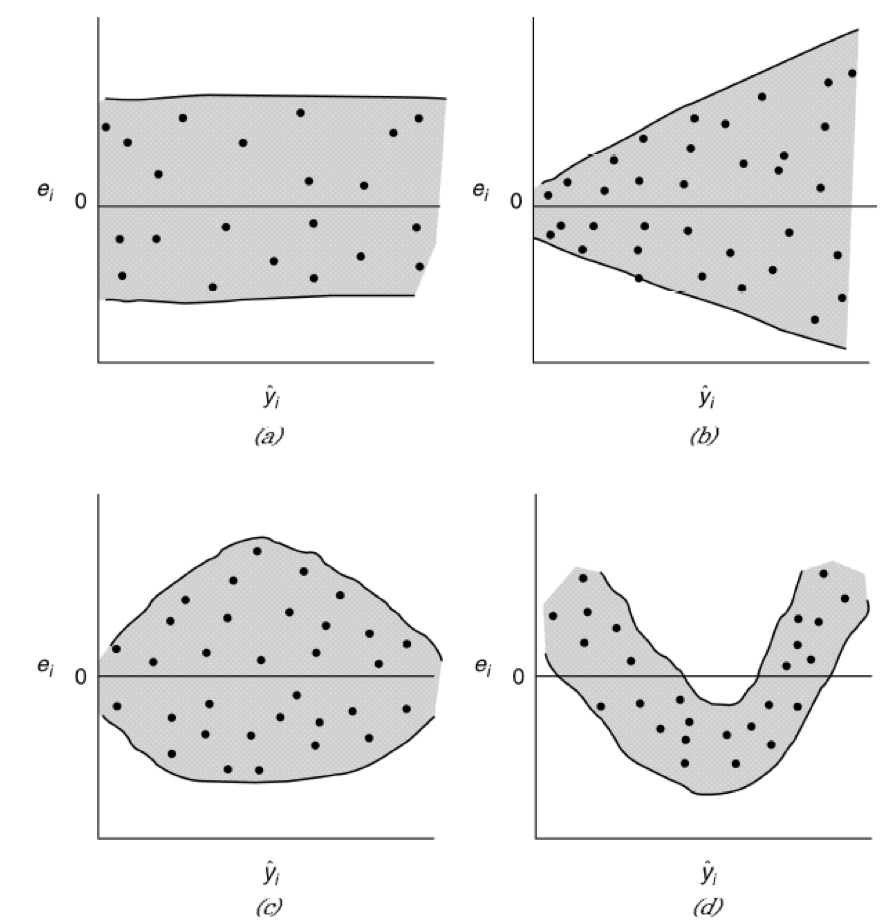

class: clear, middle

```{r setup, include=FALSE}
options(htmltools.dir.version = FALSE, servr.daemon = TRUE)

# Global chunk options
knitr::opts_chunk$set(
  cache = TRUE,
  echo = TRUE,
  dev = "svglite",
  fig.align = "center",
  message = FALSE,
  warning = FALSE,
  error = FALSE
)

# Bitmoji id
my_id <- "1551b314-5e8a-4477-aca2-088c05963111-v1"

# Load required packages
library(ggplot2)
```

.font150[

* Required reading

    - Chapters: 3, 6, and 10

    - Sections: 3.1-3.4, 3.7, 6.8, and 10.1-10.4

* Main topics:

    - Diagnostic and Remedial Measures (3.1-3.4, 3.7, 6.8,)
  
    - Model Adequacy and Outlying Observations (10.1-10.4)

]


---

# Prerequisites

.scrollable[

.font125[

```{r prerequisites, eval=FALSE}
# List of required (CRAN) packages
pkgs <- c(
  "broom",      # for augment() function  #<<
  "car",        # for vif() function  #<<
  "GGally",     # for ggpairs() function
  "ggplot2",    # for awesome graphics
  "ggrepel",    # for geom_text_repel() function
  "gridExtra",  # for grid.arrange() function
  "pdp",        # for Boston housing data
  "plotly",     # for interactive plots
  "tibble"      # for nicer data frames
)

# Install required (CRAN) packages
for (pkg in pkgs) {
  if (!requireNamespace(pkg)) {  # check if already installed
    install.packages(pkg)  # install it
  }
}
```

]

]


---
class: clear, center, middle

```{r lets-go, echo=FALSE, out.width="70%"}
set.seed(4); RBitmoji::plot_comic(my_id, tag = "lets go")
```


---
class: clear, center, middle, inverse

.font300[

What are *residual diagnostics* and *remedial measures* and why do we need them?

]


---
class: clear, center, middle, inverse

.font300[

What's wrong with my model and how do I fix it?

]


---
class: clear 

.font150[.bold[.center[.green[What are the typical assumptions of the linear regression model?]]]]

.font150[

$$Y_i = \beta_0 + \beta_1 X_{i1} + \dots + \beta_{p-1} X_{i, p-1} + \epsilon_i\\i = 1, 2, \dots, n$$

]

--

.font150[

* Independent observations: $Cov\left(\epsilon_i, \epsilon_j\right) = 0$ $\left(i \ne j\right)$

]

--

.font150[

* Constant variance: $Var\left(\epsilon_i\right) = Cov\left(\epsilon_i, \epsilon_i\right) = \sigma^2$

]

--

.font150[

* Normally distributed errors: $\epsilon_i \stackrel{iid}{\sim} N\left(0, \sigma^2\right)$ (.red[required for **traditional** statistical inference])

]

--

.font150[

* We assume that we have the .bold[.darkorange[correct model]]!

]


---
class: clear, center, middle, inverse

.font300[

How do we know if the model is ~~wrong~~ bad?

]


---
class: clear, center, middle

.font300[What is a residual?]

--

.font200[ 

$e_i = Y_i - \widehat{Y}_i$ 

.font150.red[observed error = data - fit]

]


---

# What can residual plots tell us?

.font110[

* Plot of residuals against predictor variable (checking non-linearity).

* Plot of absolute or squared residuals against predictor variable (check non-constant variance)

* Plot of residuals against fitted values (non-constant variance and non-linearity)

* Plot of residuals against time or another sequence (non-independence)

* Plot of residuals against omitted predictor variables (missing potentially important predictors)

* Boxplot of residuals (outlying observations)

* Normal probability plot of residuals (non-normality).

]


---
class: clear, middle, center

```{r example-diagnostics, echo=FALSE, fig.width=6, fig.asp=1, out.width="70%"}
# Simualated data sets
set.seed(101)
n <- 100
df1 <- tibble::tibble(
  x = runif(n, min = -5, max = 5),
  y = 1 + 2*x^2 + rnorm(n, sd = 10)
)
df2 <- tibble::tibble(
  x = runif(n, min = 1, max = 10),
  y = 1 + 4*x + rnorm(n, sd = 2*x)
)
df2 <- rbind(df2, data.frame(x = 2, y = 50))
df3 <- tibble::tibble(
  x = runif(n, min = 1, max = 10),
  y = 1 + 4*x + arima.sim(list(order = c(1,0,0), ar = 0.99), n = n, sd = 20)
)
df4 <- tibble::tibble(
  x = runif(n, min = 1, max = 10),
  y = 1 + 4*x + rlnorm(n, sd = 0.9)
)

# Fitted models
fit1 <- lm(y ~ x, data = df1)
fit2 <- lm(y ~ x, data = df2)
fit3 <- lm(y ~ x, data = df3)
fit4 <- lm(y ~ x, data = df4)

# Residuals
r1 <- residuals(fit1)
r2 <- rstandard(fit2)
r3 <- residuals(fit3)
r4 <- residuals(fit4)

# Residual plots
par(mfrow = c(2, 2))
plot(df1$x, r1, xlab = "X", ylab = "Residual", 
     main = "Misspecified mean structure")
abline(h = 0, lty = "dotted", col = "red2")
lines(lowess(df1$x, r1), col = "dodgerblue", lwd = 3)
plot(df2$x, r2, xlab = "X", ylab = "Residual",
     main = "Non-constant variance")
points(df2$x[101L], r2[101L], pch = 19, col = "red2")
abline(h = 0, lty = "dotted", col = "red2")
plot(residuals(fit3), xlab = "Index", ylab = "Residual", type = "l",
     main = "Serial correlation")
points(residuals(fit3), col = adjustcolor("black", alpha.f = 0.2))
abline(h = 0, lty = "dotted", col = "red2")
qqnorm(r4, main = "Non-normal errors", ylim = c(-5, 15))
qqline(r4, lty = "dotted", col = "red2")
```


---

# Residual analysis

.font130[

* Residuals help in identifying a misspecified mean structure (i.e., $\boldsymbol{\beta}\boldsymbol{X}$)

* *Scaled residuals* help in identifying outliers or extreme values

* Common types of residuals:

    - Standardized Residuals
    
    - Studentized residuals
    
    - PRESS Residuals 

]


---
class: clear, middle, center

.font200[Normal Q-Q plots* can be used to asses the "normalityness" of a set of observations]

<br><br>

*Q-Q plots can, in general, be used to compare data with any distribution!


---
class: clear 

.code125[
```{r qqnorm-normal, fig.width=6, fig.asp=0.618, out.width="70%"}
set.seed(101)
x <- rnorm(100)
qqnorm(x, main = "Normal data")
qqline(x, lty = "dotted", col = "red2")
```
]


---
class: clear 

.code125[
```{r qqnorm-skew-right, fig.width=6, fig.asp=0.618, out.width="70%"}
set.seed(101)
x <- rlnorm(100)
qqnorm(x, main = "Skew right data")
qqline(x, lty = "dotted", col = "red2")
```
]


---
class: clear 

.code125[
```{r qqnorm-skew-left, fig.width=6, fig.asp=0.618, out.width="70%"}
set.seed(101)
x <- -rlnorm(100)
qqnorm(x, main = "Skew left data")
qqline(x, lty = "dotted", col = "red2")
```
]


---
class: clear 

.code125[
```{r qqnorm-heavy tails, fig.width=6, fig.asp=0.618, out.width="70%"}
set.seed(101)
x <- rt(100, df = 1)
qqnorm(x, main = "Heavy-tailed data")
qqline(x, lty = "dotted", col = "red2")
```
]


---
class: clear, middle, center

.font200[When should you use normality tests?]

--

```{r never, echo=FALSE, out.width="50%"}
my_id <- "1551b314-5e8a-4477-aca2-088c05963111-v1"
set.seed(4); RBitmoji::plot_comic(my_id, tag = "never")
```


---
class: clear, middle

.font150[

```{r normality-tests, highlight.output=1:2}
# Shapiro-Wilk test and sample size
set.seed(101)  # for reproducibility
x <- replicate(100, c(
  shapiro.test(rt(10, df = 40))$p.value,
  shapiro.test(rt(100, df = 40))$p.value,
  shapiro.test(rt(1000, df = 40))$p.value,
  shapiro.test(rt(5000, df = 40))$p.value
))
rownames(x) <- c("n=10", "n=100", "n=1000", "n=5000")
rowMeans(x < 0.05)
```

]


---
class: clear, middle, center

```{r normal-vs-t, echo=FALSE, fig.width=6, fig.asp=0.618, out.width="100%"}
x <- seq(from = -5, to = 5, length = 500)
y1 <- dnorm(x)
y2 <- dt(x, df = 40)
df <- data.frame(
  x = c(x, x), 
  y = c(y1, y2),
  Distribution = rep(c("Standard\nnormal", "t(df = 40)"), each = length(x))
)
set.seed(2); comic <- RBitmoji::get_comic(my_id, tag = "fuck")
ggplot(df, aes(x = x, y = y, color = Distribution)) +
  geom_line(size = 1, alpha = 0.5) +
  labs(x = expression(x), y = "Density") +
  annotation_raster(comic, xmin = -5, xmax = -1.25, ymin = 0.25, ymax = 0.4)
```


---
class: clear, middle, center

.font300[Scaling the residuals]


---

# Standardized residuals

.font130[

$$r_i^{stan} = \frac{r_i}{\sqrt{Var\left(r_i\right)}}$$

* We want the standardized residuals to have .bold[mean zero] and .bold[unit variance]

]

--

.font150[

* Large positive/negative values of $r_i^{stan}$, say $\left|r_i^{stan}\right| > 3$ may indicate an outlier

]

--

.font150.center.content-box-blue[

So what is $Var\left(r_i\right)$? `r emo::ji("thinking")`

]


---

# Standardized residuals

.font150[

* If $\epsilon_i \stackrel{iid}{\sim} N\left(0, \sigma^2\right)$, then $\epsilon_i/\sigma \stackrel{iid}{\sim} N\left(0, 1\right)$, so it seems intuitive to define a standardized residual as $$r_i^{stan} =\frac{r_i}{\sqrt{MSE}} = \frac{r_i}{RMSE}$$

]

--

.pull-left.font200.center.red[

However, $$Var\left(r_i\right) \ne MSE$$ 

]

.pull-right[

```{r say-what, echo=FALSE, out.width="50%"}
set.seed(4); RBitmoji::plot_comic(my_id, tag = "say what")
```

]


---

# Standardized residuals

.font140[

* Recall that $r_i = Y_i - \widehat{Y}_i$, or, in matrix form $$\boldsymbol{r} = \boldsymbol{Y} - \widehat{\boldsymbol{Y}}$$

* It can be shown that the variance of $r_i$ is given by $\sigma^2\left(1 - h_{ii}\right)$, which can be estimated with $MSE\left(1 - h_{ii}\right)$

]

--

.font140[

* .purple[Studentized residual]: $r_i^{stud} = \frac{r_i}{\sqrt{MSE\left(1 - h_{ii}\right)}}$

    - Variance of residuals depends on $\boldsymbol{X}$

    - More effective at detecting outlying response values

]


---

# PRESS residuals

.font115[

* Another refinement to make the residuals more effective at detecting outlying $Y$ observations is to measure the *i*-th residual $r_i = Y_i - \widehat{Y}_i$ when the fitted regression is based on all of the cases except the *i*-th one

    - Also referred to as the __*deleted residuals*__ or __*jackknife residuals*__

    - A form of *leave one out cross-validation* (LOOCV)

* It can be shown that these residuals can be obtained without refitting the model $n$ times using $$r_i^{PRESS} = d_i = \frac{r_i}{1 - h_{ii}}$$

* PRESS statistic: $PRESS = \sum_{i=1}^n d_i^2$ (.red[useful for model building/selection])

]


---
class: clear, middle, center

```{r residual-patterms, echo=FALSE, out.width="70%"}

```


---
class: clear, middle

.code125[

```{r delivery-01}
# Load the delivery data
url <- paste0("https://bgreenwell.github.io/",
              "uc-bana7052/data/delivery.csv")
delivery <- read.csv(url)
head(delivery, n = 5)  # print first 5 observations
```

]


---
class: clear, middle

.code110[

```{r delivery-02}
# Fit an MLR model
delivery_fit <- lm(DeliveryTime ~ NumberofCases + Distance, 
                   data = delivery)

# Fitted values
yhat <- fitted(delivery_fit)
# equivalent to `yhat <- predict(delivery_fit)`  #<<

# Residuals
rorig <- residuals(delivery_fit)  # ordinary
rstan <- rstandard(delivery_fit)  # studentized
rstud <- rstudent(delivery_fit)  # studentized deleted
press <- rstandard(delivery_fit, type = "predict")  # PRESS
```

]


---

class: clear

.code90[

```{r rstandard}
getAnywhere("rstandard.lm")
```

]


---

class: clear

.code90[

```{r rstudent}
getAnywhere("rstudent.lm")
```

]


---
class: clear, middle, center

```{r leverage-influence, echo=FALSE, fig.width=6, fig.asp=0.5, out.width="90%"}
set.seed(101)
df1 <- tibble::tibble(
  x = c(1:5, 20),
  y = 1 + 2*x + rnorm(length(x))
)
set.seed(101)
df2 <- tibble::tibble(
  x = c(1:5),
  y = 1 + 2*x + rnorm(length(x))
)
df2 <- rbind(df2, data.frame(x = 20, y = 5))
df1$h <- paste0("h = ", round(hatvalues(lm(y ~ x, data = df1)), digits = 3))
df2$h <- paste0("h = ", round(hatvalues(lm(y ~ x, data = df2)), digits = 3))
p1 <- ggplot(df1, aes(x, y, label = h)) +
  geom_point(size = 2) +
  geom_smooth(method = "lm", se = FALSE) +
  ggrepel::geom_text_repel(nudge_x = 5, direction = "y", hjust = 0, 
                           alpha = 0.3, segment.alpha = 0.3) +
  ggtitle("Pure leverage point") +
  theme_light()
p2 <- ggplot(df2, aes(x, y, label = h)) +
  geom_point(size = 2) +
  geom_smooth(method = "lm", se = FALSE) +
  ggrepel::geom_text_repel(nudge_x = 5, direction = "y", hjust = 0, 
                           alpha = 0.3, segment.alpha = 0.3) +  ggtitle("Influential point") +
  theme_light()
gridExtra::grid.arrange(p1, p2, nrow = 1)
```


---
class: clear, middle, center

.font200[Such problems are easy to see when there is only a single predictor!]


---

# Remedial measures

.center.font200[

What do we do once we've discovered inadequacies in the model?

]

--

* Misspecified mean structure: transformations and non-parametric algorithms (e.g., [MARS](https://koalaverse.github.io/AnalyticsSummit18/04-MARS.html#1) or a [decision tree](https://koalaverse.github.io/AnalyticsSummit18/09-Trees.html#1)), etc.

* Non-constant variance: transformations, *weighted least squares* (WLS), and *generalized linear models* (GLMs)

* Outliers and influential values: robust and resistant regression procedures

    - See `?MASS::rlm` and `?MASS::lqs` for some options

* Autocorrelation: time series modeling


---

# Your turn

.font175[

Return to the Boston housing example from the previous lecture. Fit an MLR model using `cmed` as the response and `lstat` and `rm` as the predictors. Check the adequacy of the fitted model using the methods discussed in this lecture. Does the model appear adequate? What assumptions, if any, appear to be violated? Are there potential outlying and/or influential values?

]


---
class: clear, middle, center

```{r boston-spm, echo=FALSE, fig.width=6, fig.asp=0.618, out.width="100%"}
GGally::ggpairs(pdp::boston[, c("cmedv", "lstat", "rm")])
```


---
class: clear, middle

.code100[

```{r boston-broom-01, echo=FALSE}
library(broom)
library(dplyr)
boston2 <- pdp::boston %>%
  lm(cmedv ~ lstat + rm, data = .) %>%
  augment() %>%
  mutate(row_num = 1:n())
```

```{r boston-broom-02}
library(broom)
library(dplyr)
pdp::boston %>%
  lm(cmedv ~ lstat + rm, data = .) %>%
  broom::augment() %>%
  mutate(row_num = 1:n()) %>%
  head(5)
```

]


---
class: clear, middle, center

```{r boston-residual-plots-01, echo=FALSE, fig.width=6, fig.asp=0.618, out.width="100%"}
ggplot(boston2, aes(x = .fitted, y = .std.resid)) +
  geom_point(alpha = 0.3) +
  geom_hline(yintercept = 0, linetype = "dashed", color = "red2") +
  geom_hline(yintercept = c(-2, 2), linetype = "dotted") +
  # geom_smooth(color = "forestgreen", alpha = 0.1, se = FALSE) +
  xlab("Fitted value") +
  ylab("Standardized residual") +
  theme_light()
```


---
class: clear, middle, center

```{r boston-residual-plots-02, echo=FALSE, fig.width=6, fig.asp=0.618, out.width="100%"}
ggplot(boston2, aes(sample = .std.resid)) +
  geom_qq(alpha = 0.3) +
  geom_qq_line(linetype = "dashed", color = "red2") +
  xlab("Theoretical quantile") +
  ylab("Sample quantile") +
  theme_light()
```


---
class: clear, middle, center

```{r boston-residual-plots-03, echo=FALSE, fig.width=6, fig.asp=0.618, out.width="100%"}
ggplot(boston2, aes(x = row_num, y = .std.resid)) +
  geom_point(alpha = 0.3) +
  geom_line() +
  geom_hline(yintercept = 0, linetype = "dashed", color = "red2") +
  xlab("Index") +
  ylab("Standardized residual") +
  theme_light()
```


---
class: clear, middle, center

```{r boston-residual-plots-04, echo=FALSE, fig.width=6, fig.asp=0.618, out.width="100%"}
ggplot(boston2, aes(x = lstat, y = .std.resid)) +
  geom_point(alpha = 0.3) +
  geom_hline(yintercept = 0, linetype = "dashed", color = "red2") +
  geom_hline(yintercept = c(-2, 2), linetype = "dotted") +
  geom_smooth(color = "forestgreen", alpha = 0.1, se = FALSE) +
  ylab("Standardized residual") +
  theme_light()
```


---
class: clear, middle, center

```{r boston-residual-plots-05, echo=FALSE, fig.width=6, fig.asp=0.618, out.width="100%"}
ggplot(boston2, aes(x = rm, y = .std.resid)) +
  geom_point(alpha = 0.3) +
  geom_hline(yintercept = 0, linetype = "dashed", color = "red2") +
  geom_hline(yintercept = c(-2, 2), linetype = "dotted") +
  geom_smooth(color = "forestgreen", alpha = 0.1, se = FALSE) +
  ylab("Standardized residual") +
  theme_light()
```


---
class: clear, middle, center

.font300[Leverage values]


---

# Hidden extrapolation in MLR

.pull-left[

* It is never a good idea to make predictions outside the region covered by the training data

    - This region is difficult to visualize whenever $k > 2$
    
    - The diagonal entries of $\boldsymbol{H}$, denoted $h_{ii}$, can be useful for detecting outlying cases

]  

.pull-right[

.middle[

```{r chull, echo=FALSE, fig.width=6, fig.asp=0.618, out.width="100%"}
hull <- delivery[chull(delivery$NumberofCases, delivery$Distance), ]
ggplot(delivery, aes(x = NumberofCases, y = Distance)) +
  geom_polygon(data = hull, fill = "red", alpha = 0.1) +
  geom_point(size = 3) +
  geom_point(data = delivery[c(9, 22), ], size = 3, col = "red2") +
  theme_light()
```

]

]

- A new case, $X_{new}$, is considered "outlying" if $h_{new} = \boldsymbol{X}_{new}^\top\left(\boldsymbol{X}^\top\boldsymbol{X}\right)^{-1}\boldsymbol{X}_{new}$ lies outside of the range of the diagonal entries of $\boldsymbol{H}$
    
- See `?influence.measures`


---
class: clear, middle, center

.font200[

Cases with leverage (i.e., hat) values greater than $2p/n = 2\sum_{i=1}^nh_{ii}/n$ are considered as outliers with respect to their $X$ values!

]


---
class: clear, middle

.code80[

```{r delivery-hatvalue, fig.width=6, fig.asp=0.618, out.width="70%"}
# Which training observations might be considered as outliers?
h <- hatvalues(delivery_fit)
plot(h, type = "h", ylim = extendrange(h, f = 0.15))
abline(h = 2 * 3 / nrow(delivery), lty = "dotted")  #<<
text(h, labels = seq_len(nrow(delivery)), pos = 3, col = "red2")
```
]


---
class: clear, middle

.code80[

```{r}
# Determine outlyingness of new observations
X <- model.matrix(delivery_fit)
head(X)
X_new <- rbind(c(1, 10, 1000), c(1, 40, 3))
(h_new <- diag(X_new %*% solve(t(X) %*% X) %*% t(X_new)))
h_new > max(h)
```

]


---
class: clear, middle

.font200[

Using base R functionality (see `?plot.lm` for details):

]

.code125[

```{r base-residual-plots-01, eval=FALSE}
# Set up plotting grid
par(mfrow = c(2, 3))  # three rows and two columns
plot(delivery_fit, which = 1:6)
```

]


---
class: clear, middle, center

.font200.right[

"Analysis of outlying and influential cases is a necessary component of good regression analysis. However, it is neither automatic nor foolproof and requires good judgement by the analyst."

--The Book

]


---
class: clear, middle, center

```{r base-residual-plots-02, echo=FALSE, fig.width=6, fig.asp=2/3, out.width="100%"}
# Set up plotting grid
par(mfrow = c(2, 3))  # three rows and two columns
plot(delivery_fit, which = 1:6)
```


---
class: clear, middle, center

.font300[Multicollinearity]


---

# Multicolinearity

* In many (typically non-experimental) situations, the predictor variables tend to be correlated among themselves

* When this correlation is "high", *multicollinearity* is said to exist

* Multicollinearity does not, in general, prevent us from obtaining a good fit! It can, however, cause other issues:

    - **Multicollinearity can** cause some of the estimated coefficients to become unstable (i.e., high standard errors)
    
    - **Multicollinearity can** complicate the interpretation of the estimated coefficients (e.g., predicting crop yield from the amount of rainfall and hours of sunshine)
    
* A simple way to assess whether or not multicollinearity is present is to use *variance inflation factors* (VIFs)

    - VIFs are available from the R package [car](https://cran.r-project.org/package=car) as the next example illustrates


---

# Heart catheter example

.font150[

A study was conducted and data collected to fit a regression model to predict the length of a catheter needed to pass from a major artery at the femoral region and moved into the heart for children (Weisberg 1980). For 12 children, the proper catheter length was determined by checking with a fluoroscope that the catheter tip had reached the right position. The goal is to determine a model where a child’s height and weight could be used to predict the proper catheter length.

]

.font150.center[

[heart.R](https://github.com/bgreenwell/stt7140-env/blob/master/code/heart.R)

]


---
class: clear, middle

.code100[

```{r heart-01}
# Load required packages
library(car)     # for vif() function
library(plotly)  # for interactive plotting

# Load the data
url <- "https://bgreenwell.github.io/uc-bana7052/data/heart"
heart <- read.table(url, header = TRUE)
head(heart, 5)  
```

]


---
class: clear, middle

```{r heart-02, fig.width=6, fig.asp=0.618, out.width="100%"}
GGally::ggpairs(heart)  # scatterplot matrix
```


---
class: clear, middle

.code150[

```{r heart-03, out.width="70%"}
# Correlation matrix
(cor_mat <- cor(heart))
```

]


---
class: clear, middle

```{r heart-04, echo=FALSE, out.width="100%"}
# Interactive 3-D scatterplot
p <- plot_ly(heart, x = ~Height, y = ~Weight, z = ~Length) %>%
  add_markers() %>%
  layout(scene = list(xaxis = list(title = "Weight (pounds)"),
                      yaxis = list(title = "Height (inches)"),
                      zaxis = list(title = "Length (cm)")))
p
```


---
class: clear, middle

```{r heart-05, highlight.output=c(12:13, 18:19)}
# Fit a linear model
heart_fit <- lm(Length ~ Height + Weight, data = heart)
summary(heart_fit)
```


---
class: clear, middle

.code150[

```{r heart-06}
# Compute variance inflation factors
vif(heart_fit)  #<<
```

]

--

.font150[

* Both variance inflation factors are greater than 10 `r emo::ji("scream")`

]

--

.font150.center.content-box-blue[

What are some potential remedies?

]


---

# Remedies for multicollinearity

.font150[

* Omit some of the predictors

]

--

.font150[

* Standardize the predictor column(s) (.blue[useful in polynomial models])

]

--

.font150[

* [*Regularized regression*](https://koalaverse.github.io/AnalyticsSummit18/03-Regularization.html#1)

    - Ridge regression
    
    - The LASSO

]


---

# Your turn `r emo::ji("scream")`

.font150[

Return to the Boston housing example from the previous lecture. Fit an MLR model using `cmed` as the response and `lstat` and `rm` as the predictors. Does multicollinearity appear to be an issue here? Explain.

]


---

# Solution `r emo::ji("sunglasses")`

.font150[

```{r boston-vif}
# Compute VIF scores for the Boston housing example
pdp::boston %>%
  lm(cmedv ~ lstat + rm, data = .) %>%
  vif()
```

]

--

.center[.font300[

`r emo::ji("thumbsup")`

]]


---

# Other useful diagnostics

.font150[

* DFFITS

* DFBETAS

* Cook's distance

]


---
class: clear, middle, center

```{r quittin-time, echo=FALSE, out.width="60%"}
RBitmoji::plot_comic(my_id, tag = "quittin")
```
