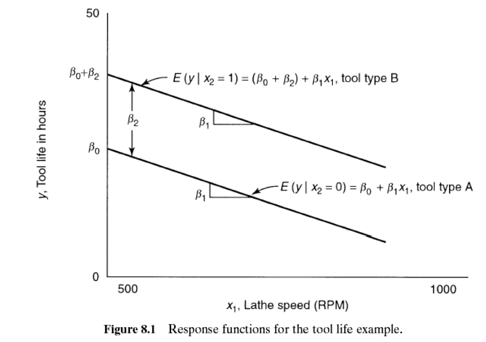
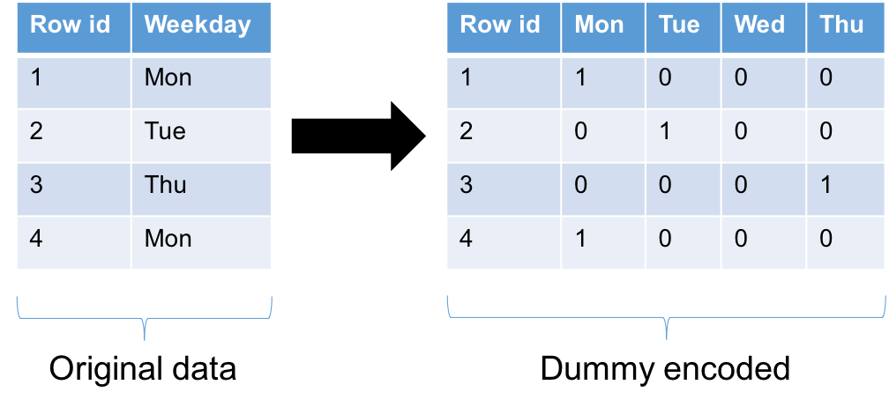
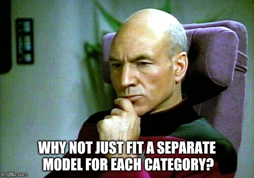

class: clear, middle

```{r setup, include=FALSE}
options(htmltools.dir.version = FALSE, servr.daemon = TRUE)

# Global chunk options
knitr::opts_chunk$set(
  cache = FALSE,
  echo = TRUE,
  dev = "svglite",
  fig.align = "center",
  # fig.width = 6,
  # fig.asp = 0.618,
  # out.width = "70%",
  message = FALSE,
  warning = FALSE,
  error = FALSE
)

# Bitmoji id
my_id <- "1551b314-5e8a-4477-aca2-088c05963111-v1"

# Load required packages
library(ggplot2)
```

.font150[

* Required reading

    - Chapters: 3, 6, and 8

    - Sections: 3.9, 6.1, and 8.1-8.7

* Main topics:

    - Regression Models for Quantitative and Qualitative Predictors (8.1-8.7)
  
    - Transformations (3.9 and 6.1)

]


---

# Prerquisites

.scrollable[

```{r prerequisites, eval=FALSE}
# List of required (CRAN) packages
pkgs <- c(
  "animation",   # for pre-built statistical animations
  "broom",       # for tidying the output from statistical models
  "dplyr",       # for data wrangling
  "ggplot2",     # for drawing nicer graphics
  "gridExtra",   # for grid.arrange() function
  "HistData",    # for historical data sets
  "investr",     # for inverse estimation
  "magick",      # for working with images
  "roundhouse",  # for pure awesomeness
  "tibble"       # for nicer data frames
)

# Install required (CRAN) packages
for (pkg in pkgs) {
  if (!(pkg %in% installed.packages()[, "Package"])) {
    install.packages(pkg)
  }
}
```

]


---
class: clear, center, middle

```{r lets-go, echo=FALSE, out.width="70%"}
set.seed(4); RBitmoji::plot_comic(my_id, tag = "lets go")
```


---

# Categorical predictors

.font115[

* Also called .magenta[*qualitative*] predictors or .magenta[*factors*]

    - [Free DataCamp exercise](https://campus.datacamp.com/courses/free-introduction-to-r/chapter-4-factors-4?ex=4)

]

--

.font115[

* [Wikipedia states that](https://en.wikipedia.org/wiki/Categorical_variable) "In statistics, a categorical variable is a variable that can take on one of a limited, and usually fixed number of possible values, assigning each individual or other unit of observation to a particular group or nominal category on the basis of some qualitative property."

    - Examples include gender (i.e., male/female), **zip code**, political affiliation, etc.

* In regression, we typically use .purple.bold[indicator variables] that take on the values 0 and 1 to identify the classes of a categorical variable

]


---

# Cutting tool example

.font120[

Suppose we want to relate the effective life of a cutting tool ( $Y$ ) used on a lathe to the lathe speed in revolutions per minute ( $X_1$ ) and type of cutting tool used ( $X_2$ ).  

* Tool type is categorical variable and can be represented using an indicator variable of the form: $$X_2 = \begin{cases} 0, & \quad \text{if tool A} \\ 1, & \quad \text{if tool B} \end{cases}$$

* If a first-order model is appropriate, then $$Y = \beta_0 + \beta_1 X_1 + \beta_2 X_2 + \epsilon$$

]

--

.font150.center.purple.bold[This implies two separate models!]


---

# Cutting tool example

.font150[

$$Y = \begin{cases} \beta_0 + \beta_1 X_1 + \epsilon, & \quad \text{if tool A} \\ \left(\beta_0 + \beta_2\right) + \beta_1 X_1 + \epsilon, & \quad \text{if tool B} \end{cases}$$

]

--

```{r cutting-tool, echo=FALSE, fig.width=6, fig.asp=0.618, out.width="70%"}
n <- 20
set.seed(1213)
df <- tibble::tibble(
  x1 = rnorm(n),
  x2 = rep(c("Tool A", "Tool B"), each = n/2),
  y = 1 + 2*x1 + 3*ifelse(x2 == "Tool A", yes = 0, no = 1) + rnorm(n)
)
ggplot(df, aes(x = x1, y = y, color = as.factor(x2))) +
  geom_point(size = 3, alpha = 0.7) +
  geom_smooth(method = "lm", se = FALSE, fullrange = TRUE) +
  theme_light() +
  labs(x = expression(X[1]), y = expression(Y)) +
  annotate("text", x = -1.5, y = 6, label = "Hypothetical data", size = 6) +
  guides(color = guide_legend(title = "")) +
  theme(axis.text.x = element_blank(),
        axis.text.y = element_blank())
```


---
class: clear, middle, center

```{r indicator-variables, echo=FALSE, out.width="100%"}

```


---

# More than two categories

* In general, a categorical variable with $K$ levels requires $K - 1$ indicator variables

* For example, if there were three different tool types (i.e., A, B, and C), then the previous regression model would become: $$Y = \beta_0 + \beta_1 X_1 + \beta_2 X_2 + \beta_3 X_3 + \epsilon,$$ where $$X_2 = \begin{cases} 1, & \quad \text{if tool B} \\ 0, & \quad \text{otherwise} \end{cases}$$ and $$X_3 = \begin{cases} 1, & \quad \text{if tool C} \\ 0, & \quad \text{otherwise} \end{cases}$$


---
class: clear, center, middle

```{r dummy-encoding, echo=FALSE, out.width="100%"}

```


---

# Categorical variables in R

.code125[

```{r categorical-variables-01}
# Categorical variable
(dow <- c("Mon", "Tue", "Wed", "Thu", "Fri"))
class(dow)
```

]


---

# Categorical variables in R

.code125[

```{r categorical-variables-02}
# Coerce to a factor; needed for use in lm()
(dow2 <- as.factor(dow))
class(dow2)
```

]


---

# Categorical variables in R

.code110[

```{r categorical-variables-03}
# R will handle dummy encoding for you
model.matrix( ~ dow2)
```

]


---

# Your turn

.font150[

The actual cutting tool data are availble in [here](https://bgreenwell.github.io/uc-bana7052/data/cutting_tool.csv). Fit a linear regression model using `Hour` as the response and `rpm` (quantiative) and `ToolType` (qualitative with two categories) as the predictors of interest. Does the model fit seem reasonable? What do you conclude about the relationship between `Hour` and `rpm` for each category of `ToolType`?

]


---

# Solution

.font300[[R code](https://github.com/bgreenwell/uc-bana7052/blob/master/code/cutting-tool.R)]


---
class: clear, middle, center

```{r thinking-picard, echo=FALSE, out.width="100%"}

```


---

# Unequal slopes

.font150.center.bold[

What if the slopes are expected to differ?

]

--

.font150[

Continuing with the previous cutting tool example:

* To model differing slopes, we can include an **interaction** (i.e., the product) between the qualitative and quantitative variables: $$Y = \beta_0 + \beta_1 X_1 + \beta_2 X_2 + \beta_3 X_1 X_2 + \epsilon$$

]

--

.font150.center.bold.blue[What models are implied here?]


---

# Cutting tool example

.font150[

$$Y = \begin{cases} \beta_0 + \beta_1 X_1 + \epsilon, & \quad \text{if tool A} \\ \left(\beta_0 + \beta_2\right) + \left(\beta_1 + \beta_3\right) X_1 + \epsilon, & \quad \text{if tool B} \end{cases}$$

]

```{r cutting-tool-unequal-slopes, echo=FALSE, fig.width=6, fig.asp=0.618, out.width="70%"}
url <- "https://bgreenwell.github.io/uc-bana7052/data/cutting_tool.csv"
cutting_tool <- read.csv(url)
ggplot(cutting_tool, aes(x = rpm, y = Hour, color = ToolType)) +
  geom_point() +
  geom_smooth(method = "lm", se = FALSE, fullrange = TRUE)
```


---

# Your turn

.font150[

Refit your previous regression model to the cutting tool data, but be sure to include an interaction between `rpm` and `ToolType`. **Hint:** use `:` to model an intercation between two predictors in `lm()` (i.e., `x1 + x2 + x1:x2`). Reinterpret your results. What are the two estimated prediction equations implied by this model? Use the general linear test aproach to compare this model with the previous one. Which model do you conclude is "better"?

]
